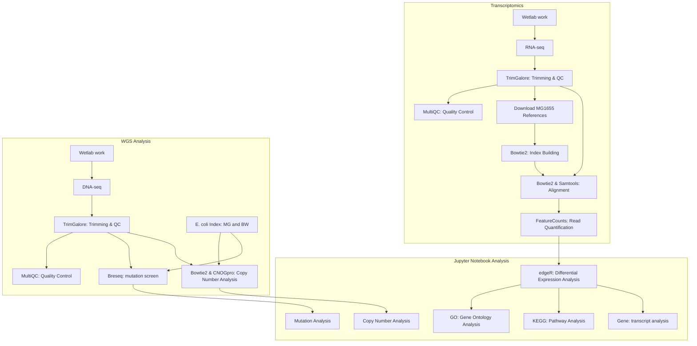

# Differences between antibiotics affecting the resistance evolution trajectories of Escherichia coli

The `scripts` directory contains scripts for running processes. The `documentation`contains workflow notebooks and other information about how the scripts were run.

## DNA

The pipeline for the mutation analysis and copy number can be found here: `scripts/nextflow_RNA/main.nf`.

The code for generating the Breseq tsv and html files can be found here `data/DNA/pipeline/breseq_compare/*/script.sh`

## RNA

The transcriptomics pipeline can be found here: `scripts/nextflow_RNA/main.nf`

## Data analysis

The notebook with the scientific questions can be found here: `documentation/RNA/scientific_questions/Scientific_questions_notebook.ipynb`.

## Container

This directory contains 3 relevant files.

`pull_container.sh`: Will pull the data analysis container from DockerHub.

`launch_jupyter.sh`: This will launch a jupyter server from the container. Meaning that all relevant data analysis packages are there in the right versions.

`render_questions.sh`: This will render the `Scientific_questions_notebook.ipynb`notebook into an interactive html file.

## Method flow chart

This is the bioinformatics workflow.  

## Which environment was used?  

All data processing done using Nextflow pipelines or scripts was done using a Conda environment which you can find here `container/conda_env.yml`. The Jupyter notebook data analysis was performed using the `container/ecoli_evolution.sif` container which can be pulled using the `container/pull_container.sh` script. You can also build it using the `container/Dockerfile` script.